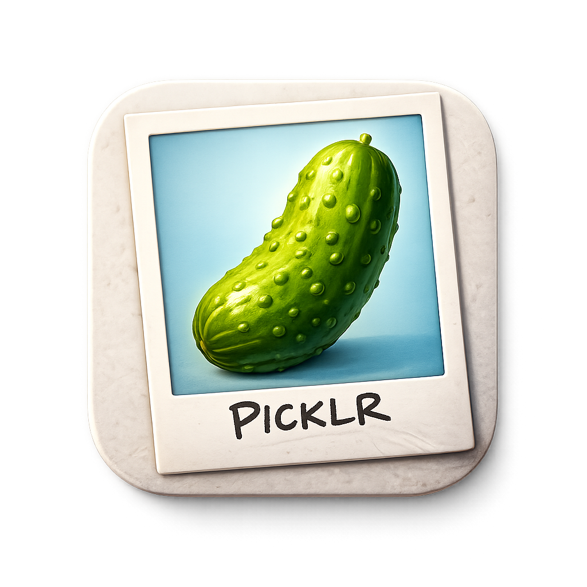

# PICLR

PICLR (**PIC**ture **L**eft/**R**ight) lets you rapidly sort through large folders of images with simple `left` and `right` actions.

## Install

### Build from a git clone

```bash
git clone <your-fork-or-this-repo-url> piclr
cd piclr
cargo install --path .
```

Run as local web service:

```bash
piclr /path/to/images
```

This will log the URL for the local web service.

Run in the Tauri desktop shell (enables native folder picker and folder switching):

```bash
cargo run --features tauri -- /path/to/images
```

### Install from crates.io

If/when the crate is published:

```bash
cargo install piclr
```

Then run:

```bash
piclr /path/to/images
```

### Install with Homebrew

If/when a formula is published:

```bash
brew install piclr
```

Then run:

```bash
piclr /path/to/images
```

### Runtime note: app vs web service

- Running with `--features tauri` launches PICLR as a desktop app and supports opening/changing folders from the UI (`Ctrl+O` / folder button).
- Running as the web service (`piclr ...` without Tauri) does not support changing folders from inside the UI. Choose the folder when launching the command.

## How to use PICLR

Start PICLR with an image directory:

```bash
piclr /path/to/images
```

If no port is provided, PICLR binds to an available loopback port and logs the URL.

### Core workflow

1. Move through images.
2. Assign left/right decisions.
3. Undo if needed.
4. Apply queued actions when ready.

By default:

- Left action: move image to `trash/`
- Right action: move image to `keep/`

### Controls

#### Navigation

- `↑` / `K`: previous image
- `↓` / `J`: next image
- `Shift+↑` / `Shift+K`: previous undecided
- `Shift+↓` / `Shift+J`: next undecided

#### Decisions and actions

- `←` / `H`: apply left action
- `→` / `L`: apply right action
- `U`: undo last command
- `Shift+A`: apply queued actions

#### Modals and utility

- `Q`: show queued actions
- `I`: show image list
- `?`: show help
- `Esc`: close top modal
- `Ctrl+O`: open directory (desktop app mode only)

You can also use the footer/header buttons for the same commands.

## DATA Stack Example

This project is an example application for the Datastar Askama Tauri Axum (DATA) Stack:

- Datastar for reactive, server-driven browser updates
- Askama for server-side HTML templating
- Tauri as a wrapper to run as a native desktop application
- Axum as the local web server and command surface

## Built with OpenAI Codex

PICLR was developed with Codex as an exercise to push its limits in an emerging technology stack.

## License

MIT. See `LICENSE`.
